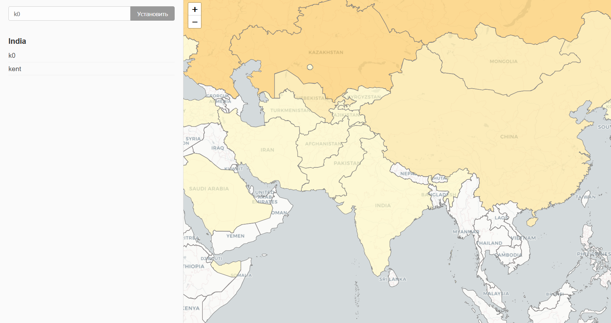

# interactive-map

Интерактивный веб-сервис для отображения карты мира и отметок пользователей о посещённых странах.

> первый пет проект на golang, chatgpt-о4 мне помогал



## Описание

Позволяет:

- Отмечать страны, в которых вы побывали, прямо на карте
- Сохранять имя пользователя и историю отметок
- Просматривать, сколько и кто посетили каждую страну
- Цвет заливки стран меняется в зависимости от числа отметок (чем больше — тем насыщеннее)

## Стек

- **Backend:** Go (`net/http`, Gorilla Mux), PostgreSQL, миграции с помощью [golang-migrate](https://github.com/golang-migrate/migrate)  
- **Frontend:** Leaflet.js, чистый JavaScript, HTML/CSS  
- **Упаковка:** Docker, Docker Compose

## Быстрый старт

1. Склонируйте репозиторий:  
```bash
git clone https://github.com/k0yt/interactive-map.git
cd interactive-map
```  
2. Запустите контейнеры:  
```bash
docker compose up --build
```  
3. Перейдите в браузере по адресу `http://localhost:8000` и начните отмечать посещённые страны!

## Структура проекта

```plaintext
.
├── db
│   └── migrations        # SQL-скрипты для создания таблиц
├── static
│   ├── app.js            # Логика фронтенда
│   ├── countries.geojson # GeoJSON-файл со странами
│   ├── index.html
│   └── style.css
├── config
│   └── config.go         # Загрузка переменных окружения
├── store
│   └── store.go          # Работа с базой данных
├── main.go               # Точка входа сервера
├── Dockerfile
├── docker-compose.yml
├── go.mod
└── README.md
```  

## Функционал

- **Регистрация имени:** введите своё имя   
- **Отметка страны:** клик по любому полигону страны на карте сохраняет вашу отметку  
- **Цветовая шкала:** страны с 1–2 отметками светло-жёлтые, с 3–5 — более тёплые и т.д.  
- **Список посетителей:** при выборе страны справа отображается список всех пользователей, которые её отметили

## Удалить данные

Удалить записи можно только напрямую из бд

1. Подключайтесь к базе как удобнее, например

`docker compose exec postgres psql -U postgres -d mapdb`

2. Запросы
```yaml
-- посмотреть всех пользователей
SELECT * FROM users;
-- удалить все связи и перезагрузиться
TRUNCATE TABLE marks, areas, users RESTART IDENTITY CASCADE;
-- удалить связи пользователя, не удаляя пользователя
DELETE FROM marks
 WHERE user_id = (SELECT id FROM users WHERE name = 'k0');
-- удалить пользователя
DELETE FROM users WHERE name = 'k0';
-- удалить конкретную отметку (по стране и id пользователя)
DELETE FROM marks
 WHERE user_id = 5
   AND area_id = 'FRA';
-- очистка всех отметок (не трогая users и areas)
DELETE FROM marks;
```


## Переменные окружения

В `docker-compose.yml` прописаны:
```yaml
environment:
  - DB_HOST=postgres
  - DB_USER=postgres
  - DB_PASSWORD=secret
  - DB_NAME=mapdb
  - HTTP_PORT=8000
```
При необходимости измените их на свои

